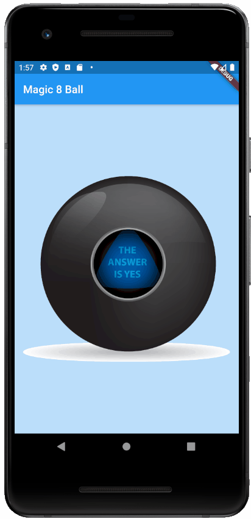

# Magic 8 Ball

This is a Flutter app I worked on following the starter code from the [Flutter Udemy course by Angela Yu](https://www.udemy.com/course/flutter-bootcamp-with-dart/).

Just a regular ol' magic 8 ball.

## Skills Learned

* Stateless and Stateful Widgets
* dart:math library for Random().nextInt()
* onPressed attribute on Buttons

## Screenshot

